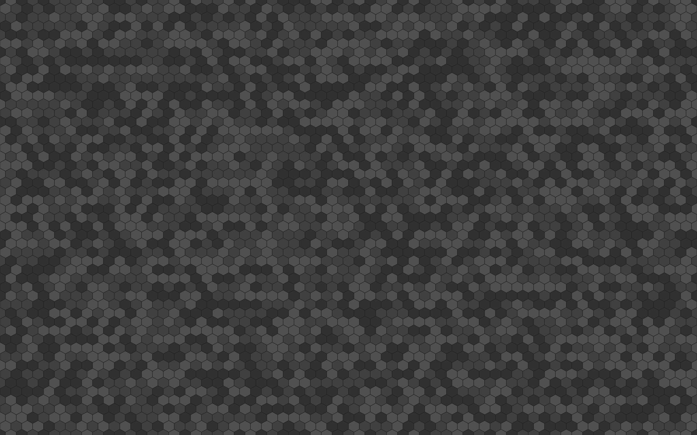
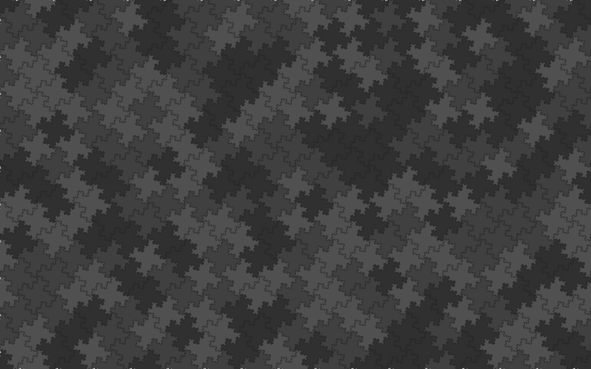

# Seamless geometric desktop background generator

SVG generator to obtain a seamless geometric desktop backgrounds with each tile having a pseudo-random fill color selected from a predefined set. The line style and fill colors are defined in an [external CSS file](resources/style.css), and therefore, easily replaceable to re-color the background image.

## Setup

### Using Nix

Clone this repository using `git` and enter the repository directory.

When using the [Nix](https://www.nixos.org) package manager, a development shell having everything set up can be started with Flakes enabled as

```sh
nix develop
```

Alternatively, the development shell can be started without even explicitly
cloning the repository as

```sh
nix develop github:ccornix/tilebg-py
```

### Manual installation into a virtual environment using `pip` (Linux)

Clone this repository using `git` and enter the repository directory.

Create a virtual environment, activate it, and install the package as

```sh
python -m venv env
. env/bin/activate
pip install .
```

Note that `python` might be invoked differently, depending on the Linux
distribution, e.g. as `python3` or `python312`.

For an editable installation with development-time dependencies, run

```sh
pip install -e .[devel]
```

instead.


## Usage

To generate one of the SVGs, run the following command

```sh
tilebg <pattern-name>
```

where `<pattern-name>` is one of those listed below in the Gallery, for instance, `hexagonal`.


## Gallery

### Tilings of the plane using randomly colored islands

#### `hexagons`

<a href="resources/hexagons.svg">
  
</a>

#### `gosperflakes2`

[Gosper islands](https://mathworld.wolfram.com/GosperIsland.html) (2 iterations)

<a href="resources/gosperflakes2.svg">
  
</a>

#### `kochflakes3`

[Koch islands](https://mathworld.wolfram.com/KochSnowflake.html) (3 iterations)

<a href="resources/kochflakes3.svg">
  
</a>

#### `minkowskiflakes4`

[Minkowski islands](https://mathworld.wolfram.com/MinkowskiSausage.html) (4 iterations)

<a href="resources/minkowskiflakes4.svg">
  
</a>


## Development

This repository follows the [Conventional Commits](https://www.conventionalcommits.org/en/v1.0.0/) specification. To enforce it, install the `gitlint` commit-msg hook on the first occasion as
```sh
gitlint install-hook
```

## References

The randomly colored hexagonal grid pattern was inspired by paepaestockphoto's artwork at

https://www.vecteezy.com/vector-art/6941002-small-hexagon-shape-with-light-white-and-grey-color-seamless-pattern-background
